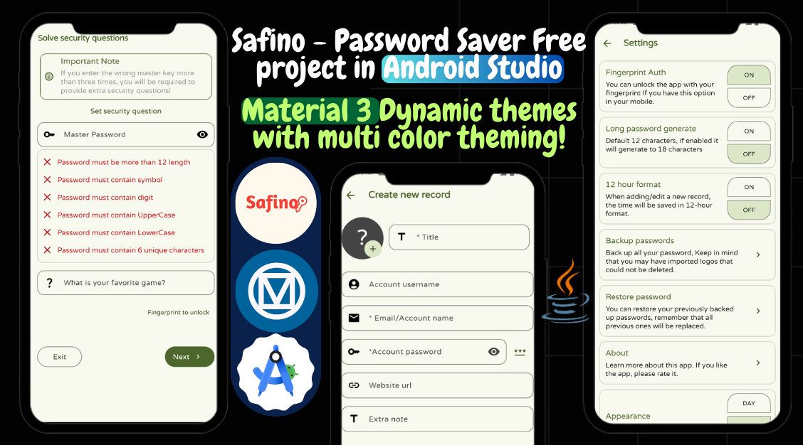

  

<h1 align="center">🔐 Safino – Offline Password Saver App</h1>

  
  Your private digital vault – beautifully designed, 100% offline, and fully customizable.  

  Built with ❤️ using Android Studio  

---

## ✨ Features at a Glance

- 🚀 **Splash Screen** with animation  
- 🗂️ **Password List** with advanced search  
- ➕ Add entries with:
  - 🖼️ Logo (via Storage Access Framework)
  - 📝 Title, account, username, password  
  - 🌐 Website & personal notes  
- ✏️ Edit | 🗑️ Delete | 📤 Share | 🔐 Secure View  
- 🔐 **Authentication**:
  - Fingerprint unlock  
  - Security question fallback  
- 💾 **Backup & Restore** (Offline only)  
- 🎨 **Dynamic Theming**:
  - Day/Night mode  
  - Full color customization  
  - Material 3 transitions  
- 🧼 **Material You UI** – modern and clean  
- ℹ️ About screen with developer credits

---

## 🛠️ Tech Stack

- 💻 **Android Studio** – full-featured development environment  
- 📱 Java | XML | Android SDK | Material Components  

---

## ❓ Why Safino?

Unlike cloud-based tools like Google Password Manager,  
**Safino stores everything 100% offline**, giving you total privacy and control.  

It’s also a powerful open-source foundation for:
- 🔧 Learning Android development  
- ⚡ Publishing your own secure password manager  
- 💰 Selling a branded version  

---

## ▶️ How to Use & Setup

### 1️⃣ Clone the Project  
- Download or clone the repository  
- Open it in **Android Studio**

### 2️⃣ Customize the App  
- ✏️ Change the app name in `res/values/strings.xml`  
- 🔁 Replace the package name using **Refactor > Rename**:
  - Update it in the manifest and Java files

### 3️⃣ Update the App Icon  
- Visit [icon.kitchen](https://icon.kitchen)  
- Generate and replace the icon files in `res/mipmap-*`

### 4️⃣ Build & Test  
- Plug in your Android device or use an emulator  
- Click **Run** or **Build APK**

---

## 🔗 Demo

Click the image at the top or  
▶️ [Watch on YouTube](https://youtu.be/dB9tdkf1o7s)

---

## ✅ Usage & Distribution Policy

- ✅ **You Can:**
  - Use, modify, and publish your own version of the app  
  - Sell the **compiled APK**  
  - Use **any Java classes** from the project however and wherever you want

- ❌ **You Cannot:**
  - Share or sell the original project structure as-is  
  - Re-upload or showcase this original codebase on **any YouTube channel**  

> This project is for **learning**, **customization**, and **app publishing** — not for raw source redistribution.

---

## ♥️ Support & Donations

If you love Safino and want to support future projects:

- **Binance Pay ID:** `766720837`  
- Every donation helps fuel future open tools!  
- Thank you for your kindness and generosity ❤️

---

## 📄 License

- **Open & Free (No Restrictions):**  
  This project is released as **CC0 1.0 Universal**. You are free to use, modify, and share it for any purpose, including commercial projects—no attribution required, no restrictions.

- **Third-Party Libraries:**  
  This project may include third-party libraries. Each library is subject to its own license. Please review their licenses if you plan to use them.

---

## ⭐ Get Involved

- 🌟 Star this repo to support the creator  
- 🛠️ Submit feature requests or improvements  
- 📤 Share your own versions with no credits required

---

> “Build it. Brand it. Publish it. Learn from it. Safino is yours to shape.”
